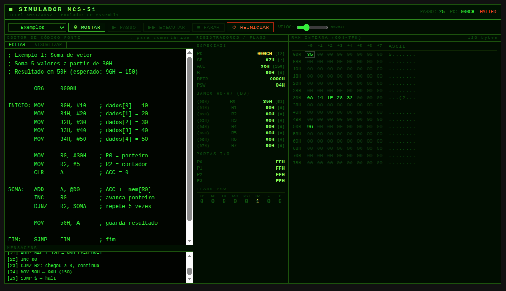

# Simulador MCS-51 (Intel 8051)

> Simulador educacional de Assembly para microcontroladores da família Intel MCS-51, desenvolvido inteiramente em HTML/CSS/JavaScript puro, sem dependências externas.



---

## Índice

- [Sobre o Projeto](#sobre-o-projeto)
- [Funcionalidades](#funcionalidades)
- [Como Usar](#como-usar)
- [Interface](#interface)
- [Conjunto de Instruções Suportado](#conjunto-de-instruções-suportado)
- [Sintaxe do Assembly](#sintaxe-do-assembly)
- [Exemplos Incluídos](#exemplos-incluídos)
- [Arquitetura Interna](#arquitetura-interna)
- [Limitações](#limitações)
- [Tecnologias](#tecnologias)
- [Licença](#licença)

---

## Sobre o Projeto

Este simulador foi inspirado nas ferramentas de desenvolvimento para 8051 amplamente utilizadas em cursos de Engenharia Elétrica e Eletrônica nos anos 1990 — como o **EMILY52** (Dunfield Development Systems), o **AVSIM 8051** (Avocet Systems) e o **HTE 8051** — que exibiam em tempo real o estado completo do processador: registradores, flags, memória e barramentos.

O objetivo é oferecer uma ferramenta didática moderna, leve e que rode diretamente no navegador, sem instalação.

---

## Funcionalidades

- **Editor de código Assembly** com suporte a comentários (`;`), labels, diretivas `ORG`, `EQU`, `END`
- **Montador (assembler) integrado** com resolução de labels e símbolos
- **Execução passo a passo** com destaque visual da instrução atual
- **Execução contínua** com velocidade ajustável (Ultra / Rápido / Normal / Lento / Passo)
- **Visualização de todos os registradores** em tempo real: PC, SP, ACC, B, DPTR, R0–R7, P0–P3, PSW
- **Visualização das flags do PSW**: CY, AC, F0, RS1, RS0, OV, P
- **Mapa da RAM interna** (128 bytes, 00H–7FH) com destaque de bytes alterados
- **Coluna ASCII** no mapa de memória
- **Log de mensagens** com descrição de cada instrução executada
- **4 programas de exemplo** prontos para uso
- **Reinicialização** completa da CPU
- **100% offline** — arquivo HTML único, sem dependências externas

---

## Como Usar

### Opção 1 — Direto no navegador

Faça o download do arquivo `simulador_8051.html` e abra-o em qualquer navegador moderno (Chrome, Firefox, Edge, Safari). Nenhuma instalação necessária.

### Opção 2 — Clonar o repositório

```bash
git clone https://github.com/seu-usuario/simulador-8051.git
cd simulador-8051
# Abra o arquivo no navegador:
xdg-open simulador_8051.html        # Linux
open simulador_8051.html            # macOS
start simulador_8051.html           # Windows
```

---

## Interface

A interface é dividida em quatro áreas principais:

```
┌─────────────────────────────────────────────────────────────┐
│  ■ SIMULADOR MCS-51          PASSO: 0   PC: 0000H   PRONTO  │  ← Barra de status
├────────────────────────────────────────────────────────────-┤
│  [Exemplos ▾] [⚙ MONTAR] [▶ PASSO] [▶▶ EXECUTAR] [↺ RST]    │  ← Barra de controles
├───────────────────┬──────────────┬──────────────────────────┤
│                   │              │                          │
│   EDITOR /        │ REGISTRADORES│    RAM INTERNA           │
│   VISUALIZADOR    │   E FLAGS    │    (00H – 7FH)           │
│                   │              │                          │
├───────────────────┤              │                          │
│   MENSAGENS       │              │                          │
└───────────────────┴──────────────┴──────────────────────────┘
```

### Barra de Controles

| Controle | Função |
|---|---|
| **Exemplos** | Carrega um dos 4 programas de exemplo |
| **⚙ MONTAR** | Executa o montador sobre o código-fonte |
| **▶ PASSO** | Executa uma única instrução |
| **▶▶ EXECUTAR** | Executa continuamente até o halt |
| **■ PARAR** | Interrompe a execução contínua |
| **↺ REINICIAR** | Reseta a CPU (mantém o programa montado) |
| **VELOC** | Controla a velocidade da execução contínua |

### Painel de Registradores

Exibe em tempo real, com **destaque em amarelo** para valores alterados na última instrução:

- **Registradores especiais**: PC, SP, ACC, B, DPTR, PSW
- **Banco de registradores ativo**: R0–R7 (com endereço físico na RAM)
- **Portas de I/O**: P0, P1, P2, P3
- **Flags individuais do PSW**: CY, AC, F0, RS1, RS0, OV, P

### Mapa de Memória

Exibe os 128 bytes da RAM interna em formato hexadecimal com 8 colunas. Bytes com valor diferente de zero aparecem em **verde brilhante**; bytes alterados na última instrução aparecem em **amarelo**. A coluna ASCII à direita exibe o caractere correspondente (ou `.` para não-imprimíveis).

---

## Conjunto de Instruções Suportado

### Transferência de Dados

| Instrução | Descrição |
|---|---|
| `MOV dst, src` | Copia valor entre registrador, memória ou imediato |
| `MOV DPTR, #data16` | Carrega valor de 16 bits no DPTR |
| `XCH A, src` | Troca o conteúdo de A com o operando |
| `PUSH direct` | Empilha byte na pilha (incrementa SP) |
| `POP direct` | Desempilha byte da pilha (decrementa SP) |

### Aritmética

| Instrução | Descrição |
|---|---|
| `ADD A, src` | A ← A + src (sem carry) |
| `ADDC A, src` | A ← A + src + CY |
| `SUBB A, src` | A ← A − src − CY |
| `INC dst` | Incrementa registrador, memória ou DPTR |
| `DEC dst` | Decrementa registrador ou memória |
| `MUL AB` | B:A ← A × B (16 bits) |
| `DIV AB` | A ← quociente, B ← resto de A÷B |
| `DA A` | Ajuste decimal de A após ADD/ADDC (BCD) |

### Lógica

| Instrução | Descrição |
|---|---|
| `ANL dst, src` | AND bit a bit |
| `ORL dst, src` | OR bit a bit |
| `XRL dst, src` | XOR bit a bit |
| `CLR A` | Zera o acumulador |
| `CLR C` | Zera o flag CY |
| `SETB C` | Seta o flag CY |
| `CPL A` | Complemento de A |
| `CPL C` | Complemento do flag CY |

### Deslocamento e Rotação

| Instrução | Descrição |
|---|---|
| `RL A` | Rotaciona A para a esquerda (circular) |
| `RLC A` | Rotaciona A para a esquerda através do carry |
| `RR A` | Rotaciona A para a direita (circular) |
| `RRC A` | Rotaciona A para a direita através do carry |
| `SWAP A` | Troca os nibbles alto e baixo de A |

### Desvios Incondicionais

| Instrução | Descrição |
|---|---|
| `SJMP label` | Desvio incondicional (Short Jump) |
| `LJMP label` | Desvio incondicional (Long Jump) |
| `AJMP label` | Desvio incondicional (Absolute Jump) |
| `JMP label` | Alias genérico para desvio incondicional |

### Desvios Condicionais

| Instrução | Descrição |
|---|---|
| `JZ label` | Salta se A = 0 |
| `JNZ label` | Salta se A ≠ 0 |
| `JC label` | Salta se CY = 1 |
| `JNC label` | Salta se CY = 0 |
| `JB bit, label` | Salta se bit = 1 |
| `JNB bit, label` | Salta se bit = 0 |
| `DJNZ dst, label` | Decrementa e salta se ≠ 0 |
| `CJNE src1, src2, label` | Salta se src1 ≠ src2 |

### Sub-rotinas

| Instrução | Descrição |
|---|---|
| `LCALL label` | Chama sub-rotina (empilha endereço de retorno) |
| `ACALL label` | Chama sub-rotina (Absolute Call) |
| `CALL label` | Alias genérico para chamada de sub-rotina |
| `RET` | Retorna de sub-rotina |
| `RETI` | Retorna de interrupção (tratado como RET) |

### Outras

| Instrução | Descrição |
|---|---|
| `NOP` | Nenhuma operação |

---

## Sintaxe do Assembly

### Regras Gerais

- **Comentários**: iniciados por `;` — tudo após o `;` na linha é ignorado
- **Labels**: identificador seguido de `:` no início da linha (ex: `LOOP:`)
- **Mnemonics**: insensíveis a maiúsculas/minúsculas
- **Números hexadecimais**: sufixo `H` (ex: `0FFH`, `30H`)
- **Números binários**: sufixo `B` (ex: `10110011B`)
- **Números decimais**: sem sufixo (ex: `127`, `-5`)
- **Imediato**: prefixo `#` (ex: `#0FFH`, `#25`, `#'A'`)
- **Indireto por registrador**: `@R0` ou `@R1`

### Diretivas Suportadas

| Diretiva | Função |
|---|---|
| `ORG endereço` | Define o endereço de origem (aceita mas não altera PC virtual) |
| `EQU valor` | Define uma constante simbólica |
| `END` | Marca o fim do código-fonte |
| `DB`, `DW` | Reconhecidas e ignoradas (não geram código) |

### Modos de Endereçamento

| Modo | Exemplo | Descrição |
|---|---|---|
| Registrador | `MOV A, R0` | Operando é um registrador |
| Direto | `MOV A, 30H` | Endereço na RAM interna |
| Indireto | `MOV A, @R0` | Endereço apontado por R0 ou R1 |
| Imediato | `MOV A, #25` | Valor literal |
| Relativo (label) | `SJMP LOOP` | Desvio para label |

### Exemplo de Código

```asm
        ORG     0000H

INICIO: MOV     R0, #20H    ; ponteiro para início dos dados
        MOV     R2, #8      ; contador = 8
        CLR     A           ; limpa acumulador

SOMA:   ADD     A, @R0      ; A += mem[R0]
        INC     R0          ; avança ponteiro
        DJNZ    R2, SOMA    ; repete até R2 = 0

        MOV     50H, A      ; salva resultado em 50H

FIM:    SJMP    FIM         ; loop infinito (halt)

        END
```

---

## Exemplos Incluídos

### 1. Soma de Vetor
Inicializa 5 valores (10, 20, 30, 40, 50) nas posições 30H–34H da RAM e os soma, armazenando o resultado (150 = 96H) em 50H. Demonstra: `MOV`, `CLR`, `ADD`, `INC`, `DJNZ`, endereçamento indireto via `@R0`.

### 2. Fatorial via Sub-rotina
Calcula 5! = 120 (78H) usando uma sub-rotina recursiva iterativa. Demonstra: `LCALL`, `RET`, `MUL AB`, `CJNE`, `DEC`, passagem de parâmetros via acumulador.

### 3. Copiar Bloco de Memória
Copia 8 bytes de 20H–27H para 40H–47H usando ponteiros em R0 e R1. Demonstra: endereçamento indireto com `@R0` e `@R1`, `DJNZ` como laço de controle.

### 4. Aritmética BCD
Realiza soma com ajuste decimal: 29H + 47H = 76 (BCD) e 99H + 01H = 00H com carry. Demonstra: instrução `DA A`, carry gerado por overflow BCD.

---

## Arquitetura Interna

O simulador implementa os seguintes componentes da arquitetura MCS-51:

### CPU

- **PC (Program Counter)**: 16 bits, indexa as instruções montadas
- **ACC (Acumulador)**: 8 bits, registrador principal de operações
- **B**: 8 bits, usado em MUL e DIV
- **SP (Stack Pointer)**: 8 bits, inicializa em 07H
- **DPTR (Data Pointer)**: 16 bits (DPH:DPL)
- **PSW (Program Status Word)**: flags CY, AC, F0, RS1, RS0, OV, -, P

### Memória

- **RAM interna**: 128 bytes (00H–7FH)
  - 00H–1FH: 4 bancos de registradores R0–R7
  - 20H–2FH: área endereçável por bit
  - 30H–7FH: RAM de uso geral
- **Pilha**: cresce para cima a partir do SP, dentro da RAM interna

### Flags

| Flag | Bit PSW | Descrição |
|---|---|---|
| CY | 7 | Carry / Borrow |
| AC | 6 | Auxiliary Carry (nibble) |
| F0 | 5 | Flag de uso geral |
| RS1, RS0 | 4–3 | Seleção do banco de registradores |
| OV | 2 | Overflow aritmético |
| P | 0 | Paridade do acumulador (automático) |

### Ciclo de Execução

```
 Busca instrução em prog.instrs[PC]
          │
          ▼
   Decodifica opcode e operandos
          │
          ▼
   Executa operação (lê/escreve RAM, registradores, flags)
          │
          ▼
   Registra células alteradas (chgR, chgM)
          │
          ▼
   Atualiza PC → próxima instrução ou label de desvio
          │
          ▼
   Renderiza interface (registradores, memória, log)
```

---

## Limitações

As seguintes funcionalidades do 8051 real **não estão implementadas** nesta versão:

- **Temporizadores / Timers** (Timer 0 e Timer 1)
- **Interrupções** (INT0, INT1, Timer, Serial)
- **Porta Serial / UART**
- **RAM externa** (XRAM — 64KB via MOVX)
- **ROM de programa** separada da RAM (o simulador usa uma lista de instruções pré-montadas)
- **Instruções de bit direto** com endereços de SFR (ex: `SETB P1.3`)
- **Diretivas DB/DW** com geração de tabelas de dados na memória
- **Modo de endereçamento indexado** `A+DPTR` / `A+PC` (MOVC)

---

## Tecnologias

O simulador é escrito inteiramente em tecnologias web padrão, sem frameworks ou bibliotecas:

- **HTML5** — estrutura da interface
- **CSS3** — estilo com variáveis CSS (tema terminal verde em fundo preto)
- **JavaScript (ES6+)** — montador, simulador e renderização

O arquivo `simulador_8051.html` é totalmente autocontido: sem dependências externas, sem CDN, sem servidor.

---

## Estrutura do Código

```
simulador_8051.html
│
├── <style>          — CSS com tema CRT/terminal verde
│
├── <div id="app">   — Interface principal
│   ├── #tbar        — Barra de título e status
│   ├── #toolbar     — Botões de controle e seletor de exemplos
│   └── #main
│       ├── #ep      — Painel esquerdo: editor + log
│       ├── #rp      — Painel central: registradores e flags
│       └── #mp      — Painel direito: mapa de memória
│
└── <script>
    ├── EX{}         — Objeto com os 4 programas de exemplo
    ├── assemble()   — Montador de dois passos (labels + resolução)
    ├── class Sim8051 — Modelo da CPU e memória
    ├── execStep()   — Decodificação e execução de instruções
    ├── render*()    — Funções de renderização da interface
    └── Eventos      — Listeners dos botões e controles
```

---

## Licença

Este projeto é disponibilizado sob a licença **MIT**.

```
MIT License

Copyright (c) 2026

Permission is hereby granted, free of charge, to any person obtaining a copy
of this software and associated documentation files (the "Software"), to deal
in the Software without restriction, including without limitation the rights
to use, copy, modify, merge, publish, distribute, sublicense, and/or sell
copies of the Software, and to permit persons to whom the Software is
furnished to do so, subject to the following conditions:

The above copyright notice and this permission notice shall be included in all
copies or substantial portions of the Software.

THE SOFTWARE IS PROVIDED "AS IS", WITHOUT WARRANTY OF ANY KIND, EXPRESS OR
IMPLIED, INCLUDING BUT NOT LIMITED TO THE WARRANTIES OF MERCHANTABILITY,
FITNESS FOR A PARTICULAR PURPOSE AND NONINFRINGEMENT.
```

---

*Desenvolvido com inspiração nas ferramentas de simulação 8051 da era DOS, para fins educacionais.*
